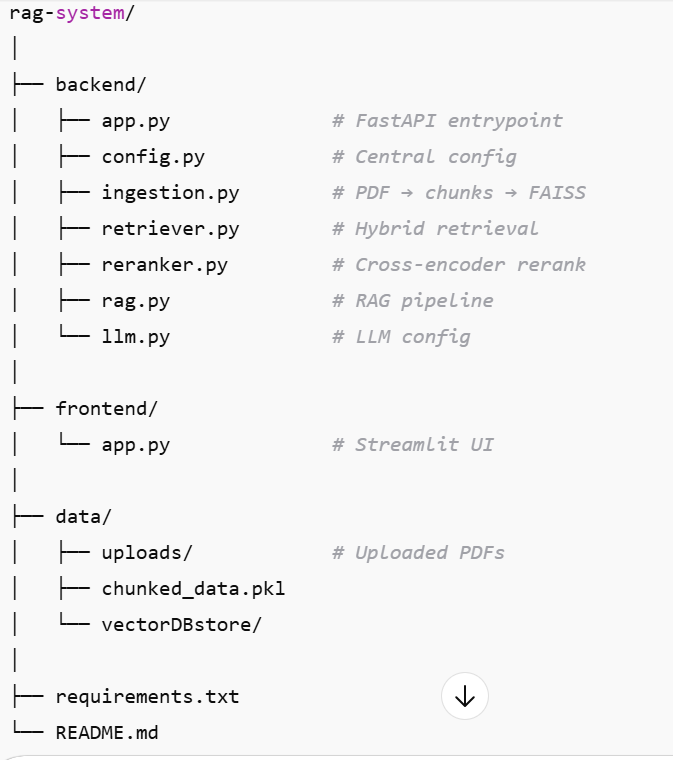
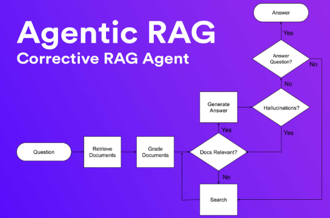
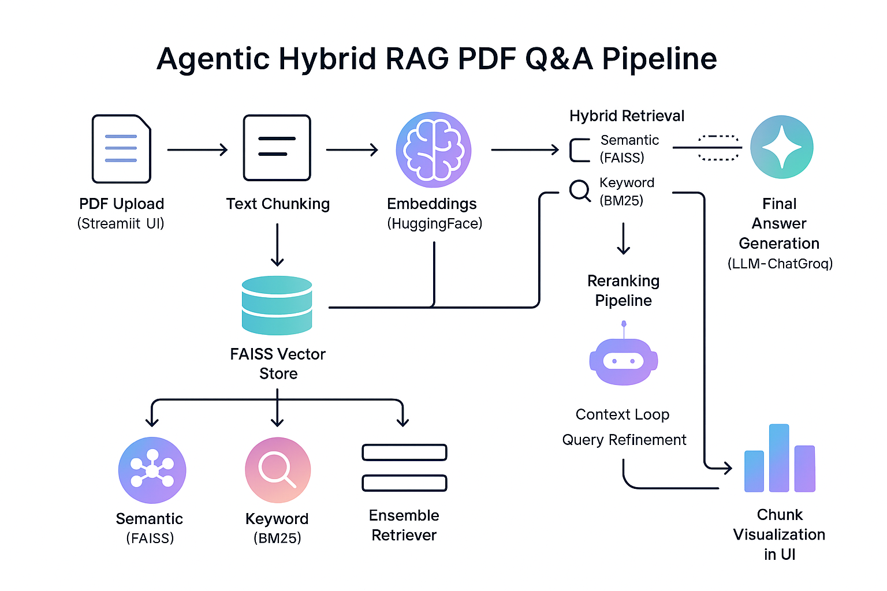
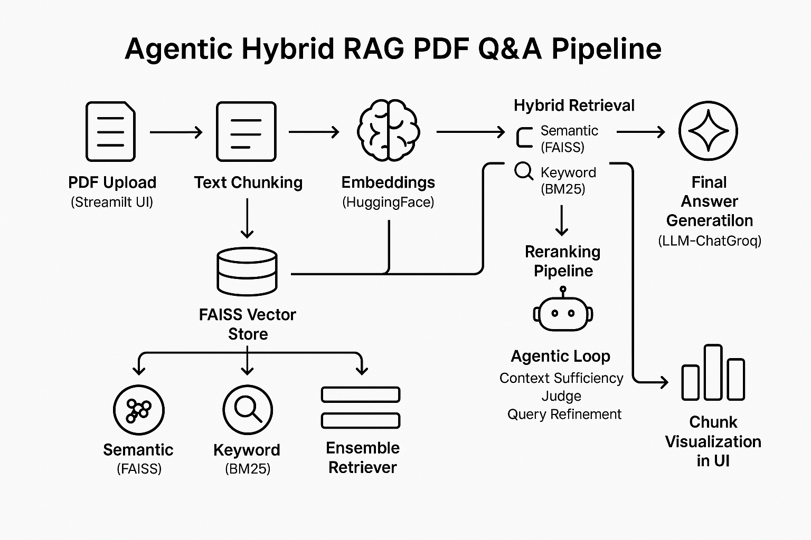
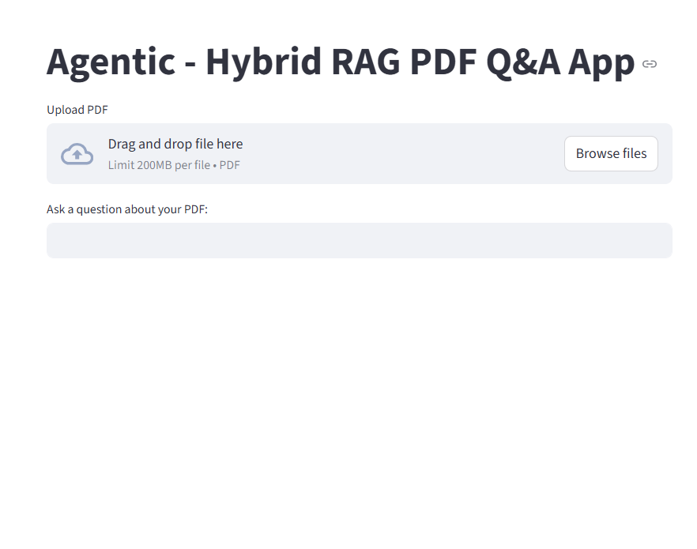
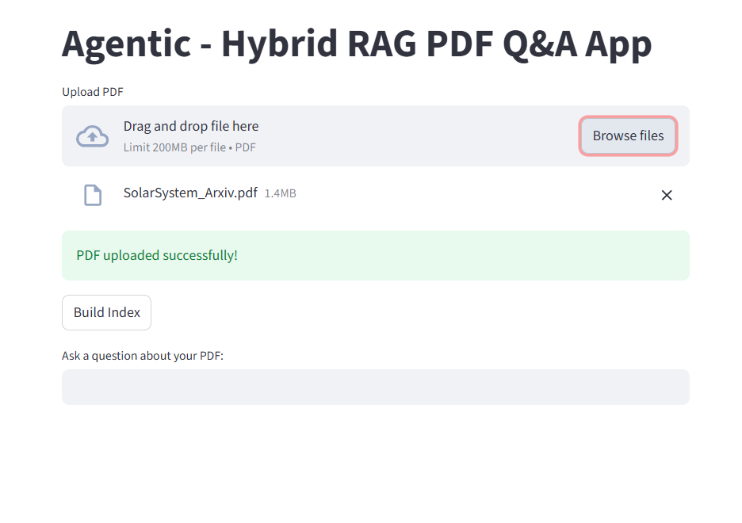
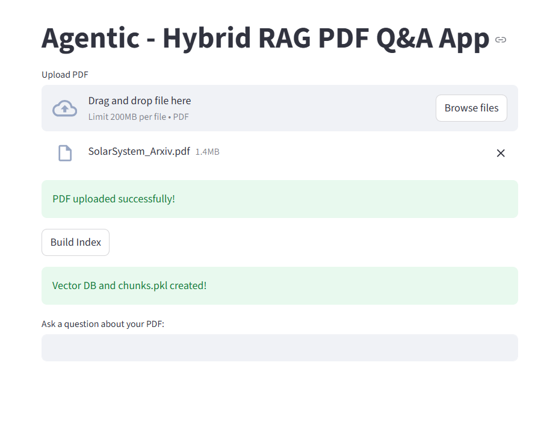
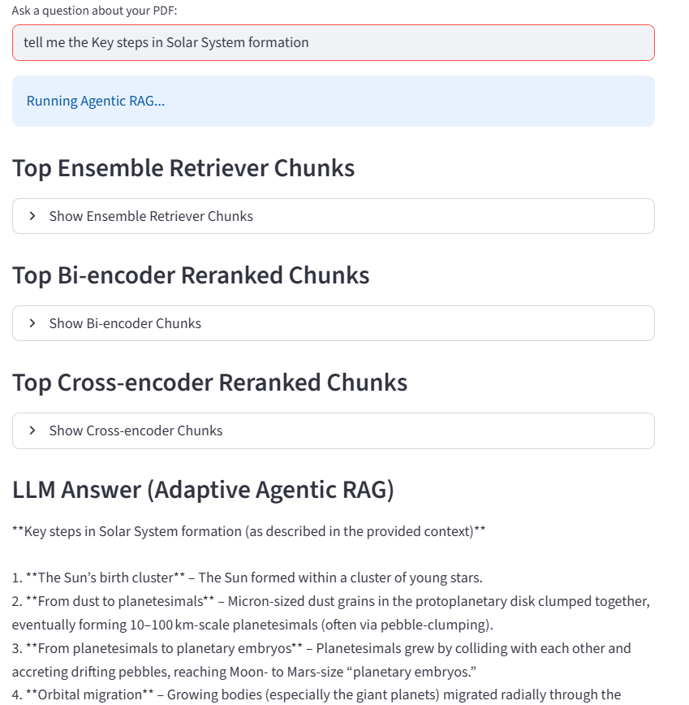

# Adaptive Agentic RAG PDF Q&A App

This application allows users to upload PDFs and ask questions about their content using a hybrid retrieval system combined with large language models (LLMs). The system leverages **semantic search**, **keyword search**, and **bi-/cross-encoder reranking** to provide accurate answers.

     - combination of hybrid retrieval,
     - multi-stage reranking, and 
     - an agentic LLM-driven refinement loop
# folder structure



## Features

- Upload PDF documents and extract text.
- Chunk PDF text and build a vector index for semantic retrieval.
- Hybrid retrieval using:
  - FAISS-based semantic retrieval
  - BM25 keyword-based retrieval
  - Ensemble of both retrievers
- Bi-encoder and cross-encoder reranking for precise document selection.
- Agentic retrieval-augmented generation (RAG) that:
  - Iteratively refines queries if context is insufficient
  - Uses only top cross-encoder chunks to answer questions using Groq LLM
- Streamlit-based interactive interface with expandable views for:
  - Ensemble retriever chunks
  - Bi-encoder reranked chunks
  - Cross-encoder reranked chunks


  ## Installation

1. **Clone the repository:**
   ```bash
   git clone <repo_url>
   cd <repo_folder>
   python -m venv venv
   source venv/bin/activate  # Linux/Mac
   venv\Scripts\activate     # Windows
   pip install -r requirements.txt

Create a .env file with your Groq API key:
`GROQ_API=your_groq_api_key`


## Project Flow

The Agentic RAG PDF Q&A App follows a structured workflow from PDF upload to LLM-based answering.

---

### **1. User Interface (Streamlit)**
- **PDF Upload:** User uploads a PDF file.
- **Build Index:** Extract and chunk text, create vector embeddings, and store in FAISS.
- **Ask Questions:** User inputs a query about the PDF content.

---

### **2. PDF Processing**
- Extract text from each page using PyPDF2.
- Split text into overlapping chunks for better retrieval.
- Save chunks locally in `chunks.pkl` for Keyword search based retrieval ( BM25 ).

---

### **3. Embedding & Indexing**
- Generate embeddings for chunks using `sentence-transformers/all-mpnet-base-v2`.
- Save FAISS vector store locally as `vectorDBstore`.

---

### **4. Hybrid Retrieval**
- **Semantic Retrieval:** FAISS similarity search.
- **Keyword Retrieval:** BM25 keyword-based search on chunks.
- **Ensemble Retriever:** Weighted combination of semantic (0.9) and keyword (0.1) retrievers.

---

### **5. Reranking**
- **Bi-encoder Reranking:** Coarse ranking of top 20 chunks.
- **Cross-encoder Reranking:** Fine-grained ranking of top 5 chunks.

---

### **6. Agentic RAG Loop**
- Evaluate if context is sufficient using the LLM.
- If insufficient, refine query and repeat retrieval.
- Maximum iterations: 2.
- Final answer generated only from top cross-encoder chunks.

---

### **7. Output & Visualization**
- Display chunks retrieved by each stage:
  - Ensemble Retriever
  - Bi-encoder Reranked
  - Cross-encoder Reranked
- Show final LLM answer.

---

### **Flow Diagram**







Output

frontend:










### 1. Hybrid Retrieval
- Combines **semantic embeddings (FAISS)** and **keyword-based retrieval (BM25)**.
- Ensures comprehensive document coverage while maintaining relevance.
- Reduces the chance of missing important information compared to single-method retrieval.

### 2. Multi-stage Reranking
- **Bi-encoder reranking** filters the top relevant chunks.
- **Cross-encoder reranking** refines results for high-precision retrieval.
- Minimizes noise and ensures that only the most relevant context is passed to the LLM.

### 3. Agentic LLM-driven Refinement
- Dynamically **checks whether retrieved context is sufficient** using the LLM.
- Automatically **refines queries** if initial context is insufficient.
- Improves answer accuracy and confidence in scientific or technical queries.


## Tech Stack

### **Programming Language**
- **Python 3.12+** – Core language for development, scripting, and AI integration.

### **Frontend / UI**
- **Streamlit** – Interactive web interface for uploading PDFs, building indexes, and querying documents. 
### **Document Processing**
- **PyPDF2** – Extract text content from PDF files.
- **pickle** – Store chunked documents for fast local access.

### **Vector Embeddings & Retrieval**
- **Sentence-Transformers / HuggingFaceEmbeddings** – Generate dense vector representations of document chunks.
- **FAISS (Facebook AI Similarity Search)** – Efficient vector database for semantic retrieval.
- **BM25Retriever (from LangChain Community)** – Keyword-based retrieval for complementary search.
- **EnsembleRetriever (LangChain Classic)** – Combines semantic and keyword retrievers with configurable weights.

### **Reranking**
- **Bi-encoder (`all-MiniLM-L6-v2`)** – Initial ranking of document chunks based on cosine similarity.
- **Cross-encoder (`cross-encoder/ms-marco-MiniLM-L-6-v2`)** – Fine-grained ranking for top chunks.

### **Large Language Model**
- **ChatGroq (via LangChain Groq integration)** – Generates answers, judges context sufficiency, and refines queries.
- **Environment Management:** `.env` for securely storing API keys (e.g., GROQ API).

### **Development Utilities**
- **pathlib** – File and path handling.
- **os** – Environment variable and filesystem management.
- **dotenv** – Load environment variables from `.env` files.

### **Libraries / Frameworks**
- **LangChain** – Orchestration of retrievers, embeddings, and LLM calls. 


## Key Parameters

This section summarizes the main parameters that control PDF processing, retrieval, reranking, and LLM behavior in the Agentic Hybrid RAG PDF Q&A system.

### 1. PDF Processing
| Parameter | Description | Default / Example |
|-----------|-------------|-----------------|
| `chunk_size` | Number of characters per text chunk when splitting PDFs | `1000` |
| `overlap` | Number of overlapping characters between consecutive chunks | `200` |

### 2. Retrieval
| Parameter | Description | Default / Example |
|-----------|-------------|-----------------|
| `semantic retriever k` | Number of top semantic matches retrieved from FAISS | `10` |
| `keyword retriever k` | Number of top keyword matches retrieved from BM25 | `10` |
| `ensemble weights` | Relative weighting for semantic vs. keyword retrievers in EnsembleRetriever | `[0.9, 0.1]` |

### 3. Reranking
| Parameter | Description | Default / Example |
|-----------|-------------|-----------------|
| `bi_encoder top_k` | Number of top chunks selected after bi-encoder reranking | `20` |
| `cross_encoder top_k` | Number of top chunks selected after cross-encoder reranking | `5` |
| `bi_encoder_model` | Model used for bi-encoder similarity scoring | `"all-MiniLM-L6-v2"` |
| `cross_encoder_model` | Model used for cross-encoder fine-grained scoring | `"cross-encoder/ms-marco-MiniLM-L-6-v2"` |

### 4. Agentic Loop
| Parameter | Description | Default / Example |
|-----------|-------------|-----------------|
| `max_iters` | Maximum iterations for query refinement if context is insufficient | `2` |
| `context sufficiency check` | Uses LLM to decide if retrieved context is enough | `YES / NO` |
| `query_refinement_prompt` | LLM prompt for rewriting questions for better retrieval | Custom prompt in `refine_query()` |

### 5. LLM / Generation
| Parameter | Description | Default / Example |
|-----------|-------------|-----------------|
| `LLM model` | Model used for question answering and agentic tasks | `"openai/gpt-oss-120b"` via ChatGroq |
| `temperature` | Controls randomness of LLM output | `0.5` |
| `answer_context` | Chunks used as the sole source for LLM answers | Top cross-encoder chunks |
| `max_answer_tokens` | Optional parameter to limit LLM response length | N/A (configurable via API) |

### 6. Storage / Files
| Parameter | Description | Default / Example |
|-----------|-------------|-----------------|
| `chunks.pkl` | Pickle file storing chunked PDF text | `chunks.pkl` |
| `vectorDBstore` | FAISS vector store directory | `vectorDBstore` |

> These parameters allow users and developers to **tune retrieval precision, reranking effectiveness, and answer quality**, making the system adaptable for different PDF sizes and query complexity.
